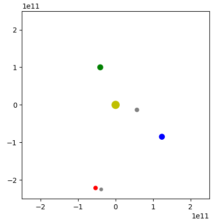

# Solar system

### Simulation of the inner planets of the solar system using the Beeman algorithm.

To visualise, run `python simulation.py`. The orbital period of each planet is printed periodically.

A satellite can be launched from Earth to Mars by running `python simulation.py sat`. Below, the satellite is seen approaching Mars.

The time taken to reach Mars is also calculated.